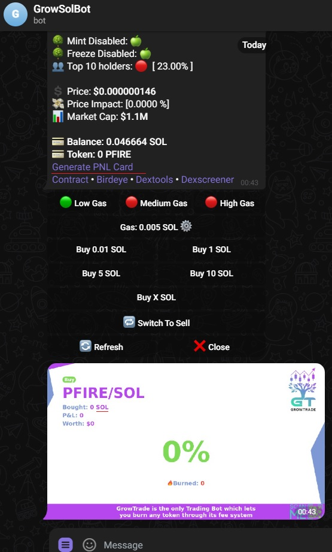
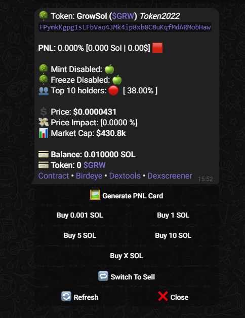

# Solana Trading Bot (Raydium, Jupiter, Pump.fun)

## Overview
A powerful Telegram bot for trading, tracking, and managing Solana-based tokens across multiple platforms.

## Features

| Category | Features |
|----------|----------|
| **Tracking** | • Track all tokens across Raydium (AMM, CLMM), Jupiter, Pump.fun<br>• Real-time price monitoring<br>• Market trend analysis |
| **Trading** | • Buy and sell all SPL tokens using JITO<br>• Execute trades on Raydium, Jupiter, Pump.fun<br>• Auto-buy/sell based on user settings |
| **Analytics** | • PNL Card generation<br>• Performance metrics<br>• Transaction history |
| **Security** | • Creates new GT wallet - no private key required<br>• Secure authentication process<br>• Encrypted communication |

## Screenshots




## Tech Stack

| Category | Technologies |
|----------|--------------|
| **Language** | Typescript |
| **Blockchain** | Solana/web3, JITO |
| **DEX & API** | Raydium SDK, Jupiter API, Pump.fun |
| **Data** | Birdeye API |
| **Storage** | MongoDB, Redis |
| **Interface** | Telegram API |

## Versions

### Basic vs Advanced Features

| Feature | Basic Version | Advanced Version |
|---------|---------------|------------------|
| **Token Tracking** | All tokens on major platforms | + Custom token alerts<br>+ Watchlist management |
| **Trading** | Manual & basic auto trading | + Advanced trading strategies<br>+ Stop-loss & take-profit<br>+ Dollar-cost averaging |
| **Analytics** | Basic PNL tracking | + Advanced portfolio analytics<br>+ Historical performance graphs<br>+ Tax reporting exports |
| **Alerts** | Price alerts | + Whale movement alerts<br>+ Volume spike detection<br>+ Pattern recognition |
| **Risk Management** | Basic settings | + Risk assessment tools<br>+ Portfolio diversification metrics |
| **UI** | Standard commands | + Custom dashboard<br>+ Inline keyboard navigation |
| **API Integration** | Standard APIs | + Additional data sources<br>+ Custom API connectivity |

## Advanced Version Features (Coming Soon)

The Advanced version builds upon the basic version with:

- **AI-powered trading signals** - Predictive analytics based on market patterns
- **Multi-wallet management** - Control and monitor multiple wallets from a single interface
- **Custom trading strategies** - Build and deploy complex trading strategies with conditional logic
- **Enhanced security features** - 2FA, IP restrictions, and suspicious activity detection
- **Advanced charting tools** - Directly in Telegram interface
- **Priority transaction processing** - Faster execution during congested market periods
- **Premium support** - Dedicated customer support with faster response times

## Prerequisites

Before you begin, ensure you have met the following requirements:

- Node.js installed (v18 or above recommended)
- Telegram bot token from BotFather
- MongoDB Cluster URI
- Redis URI

## Setup and Installation

1. Clone the repository:

```sh
git clone https://github.com/crypto-artisan/TradeSol.git
```

2. Go to the project directory:

```sh
cd TradeSol
```

3. Install the dependencies:

```sh
npm install
```

4. Create a new `.env` file and add your configuration:

`.env` file
```sh
MONGODB_URL=
REDIS_URI=

# Local
GROWTRADE_BOT_ID=
GROWSOL_ALERT_BOT_ID=
BridgeBotID=
ALERT_BOT_API_TOKEN=
TELEGRAM_BOT_API_TOKEN=

MAINNET_RPC=
PRIVATE_RPC_ENDPOINT=
RPC_WEBSOCKET_ENDPOINT=

JITO_UUID=

BIRD_EVE_API=

GROWSOL_API_ENDPOINT=

PNL_IMG_GENERATOR_API=
```

5. Then run the bot:

```sh
npm run serve
```

## Version History
- v1.0: Initial Release (21/6/2024)
- v2.0: Advanced Features (Coming Soon)

## Contact

- [Telegram](https://t.me/JohnDAT0218)
- [Github](https://github.com/crypto-artisan)